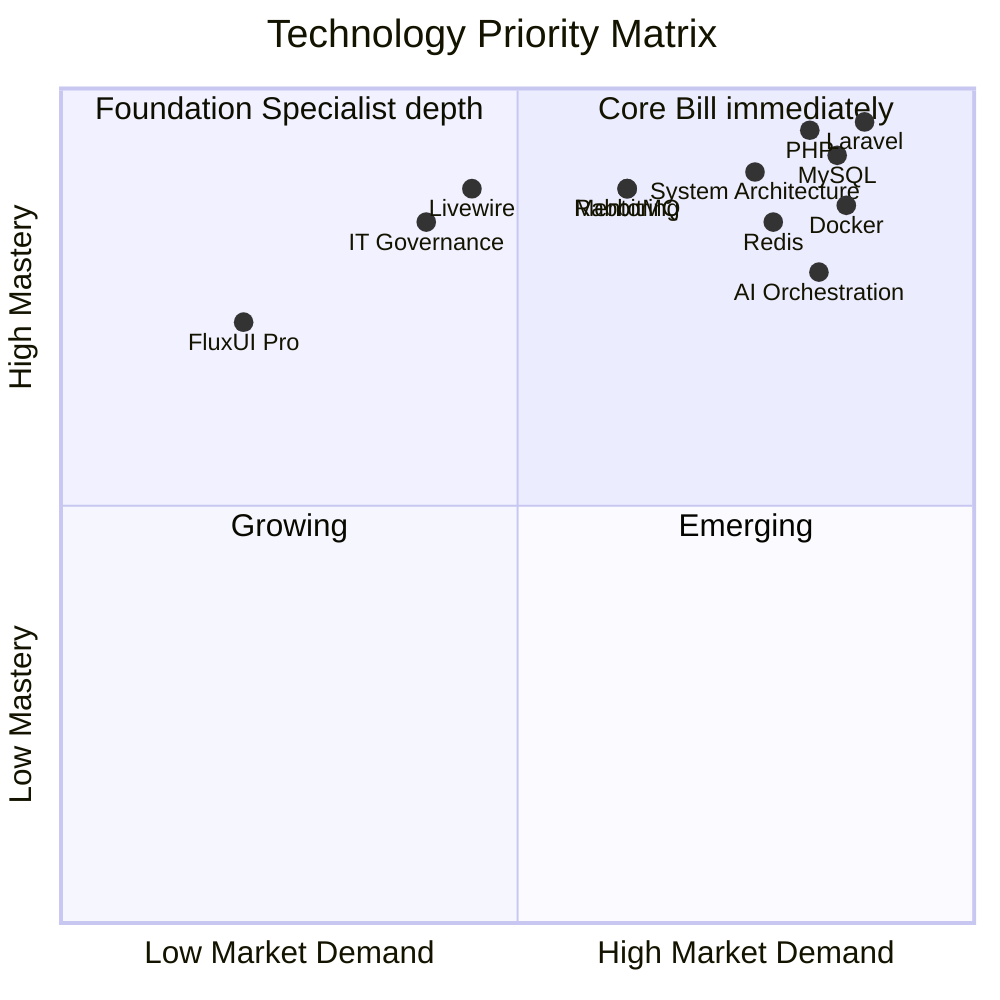

# Anderson de Oliveira Venturini

*Senior PHP/Laravel Engineer · Solutions Architect · AI Agent Orchestration · UTC-3 · Open to Remote*


[](https://github.com/andersonoliveiraventurini/esquadrao-classe-a)

**→ Senior PHP/Laravel architect with 15+ years building mission-critical systems for one of Brazil's largest public research universities. Now solo-architecting an AI-driven ERP SaaS in production.**

> **Available for** senior backend / software-architect roles and PHP/Laravel + AI-integration consulting.
> **Engagement** — Full-time (FTE / EOR) · Contractor (PJ) · Project-based consulting
> **Location** — Remote worldwide (based in Brazil, UTC-3) · open to relocation with sponsorship · hybrid across the Americas
> **Markets** — United States · Europe · LATAM · full overlap with the US working day

---

## Snapshot

A senior PHP/Laravel architect who takes products from architecture to production **solo** — and an early, in-production practitioner of multi-LLM agent orchestration. This page is the technical record behind my [LinkedIn](https://www.linkedin.com/in/anderson-de-oliveira-venturini/): real systems, real federal regulators, real scale — most of it shipped under the constraints of a public institution and a confidential commercial client.

Because those run inside a public university (UNICAMP) and a confidential client, the source is closed. What you can verify from the outside:

- 13+ continuous years at the same institution as senior engineer and solutions architect
- Elected member of UNICAMP's IT Governance Council (GovTIC, 2024–2026 term)
- M.Sc. candidate in Technology, Information and Communication Systems (UNICAMP, expected July 2026)
- Visiting Professor and Technical Instructor roles in 2025 (UNASP, SENAC)
- 60+ developers and 600+ administrative staff trained as UNICAMP instructor since 2019
- **One fully open-source project** — [Esquadrão Classe A](https://github.com/andersonoliveiraventurini/esquadrao-classe-a), a public multi-agent orchestration marketplace you can install and inspect (detailed below)

---

## Time-Zone & Collaboration Advantage

Based in Brazil at **UTC-3**, I work the same hours your team does — a **full overlap with the US working day** and a **productive morning sync with Europe** — without the 24-hour async lag of far-offshore models. The decisions that shape an architecture happen live, in the same conversation, not in a next-day email thread.

| Dimension                  | What you get working with me                                                       |
| -------------------------- | --------------------------------------------------------------------------------- |
| **US working-day overlap** | Full — same-day decisions, live pairing, no overnight handoff                      |
| **EU morning overlap**     | Full morning window for syncs, reviews, and planning                               |
| **Communication**          | Professional working English; direct, ownership-driven, low interpretation overhead |
| **Seniority**              | 15+ years of mission-critical PHP/Laravel — architecture-level decisions, not ticket execution |
| **Domain depth**           | Government, compliance and fiscal integration (NF-e, LGPD, federal APIs)           |

> The differentiator is not cost. It is being present — technically, linguistically, and culturally — at the moment the architecture decision gets made. That is what UTC-3 plus 15 years of mission-critical PHP/Laravel produces.

---

## Why Anderson — The Case in Numbers

| Metric                                  | Evidence                                                                                                |
| --------------------------------------- | ------------------------------------------------------------------------------------------------------- |
| **15+ years**                           | PHP/Laravel architecture and delivery, mission-critical systems                                         |
| **8,500+ employees**                    | Reach of the Internal Facilitators' Network across 50+ departments at UNICAMP                           |
| **100+ active projects / month**        | SIGPOD construction & document management system at UNICAMP scale                                       |
| **400+ documents / day**                | Generated daily by SIGPOD under Brazilian public procurement law                                        |
| **~60% bug-fix cycle reduction**        | Post-refactoring of SIGPOD legacy procedural PHP 5.5 → OO PHP 7.3                                       |
| **Days → hours**                        | Regulatory reporting time after Controlled Chemical Products system go-live                             |
| **R$ 4M / month**                       | Revenue scale of the commerce client whose AI-driven ERP I solo-architected                             |
| **15+ hours / week**                    | Manual data entry eliminated by the AI agent orchestrator (OpenClaw + Claude + Gemini Flash + Ollama)   |
| **3 federal regulators**                | Live API integrations: Brazilian Army, Federal Police, São Paulo Civil Police (Controlled Products)     |
| **Team of 10**                          | English Proficiency Platform delivered with GetNet payment gateway integration                          |
| **Team of 5**                           | Library Management System delivered end-to-end in TypeScript                                            |
| **60+ developers / 600+ staff trained** | As Laravel and web development instructor at UNICAMP since 2019                                         |

---

## Technical Profile — Production Stack

Aggregated from active production systems as of June 2026:

| Layer                       | Stack                                                                                  | Depth |
| --------------------------- | -------------------------------------------------------------------------------------- | ----- |
| **Backend / Architecture**  | PHP 8.x · Laravel 12 · Service Classes · Form Objects · DDD · SOLID · PSR-12 | ★★★★★ |
| **Frontend (server-driven)**| Livewire 3 · Volt · FluxUI Pro · Blade · Tailwind CSS · Alpine.js                      | ★★★★☆ |
| **Async & Messaging**       | RabbitMQ · Laravel Queues · Event-Driven Architecture · Redis · Laravel Octane         | ★★★★★ |
| **RDBMS**                   | MySQL 8 · PostgreSQL · MariaDB · MSSQL Server · query optimization · N+1 prevention    | ★★★★★ |
| **Document DB**             | MongoDB (used in TypeScript-based UNICAMP systems)                                     | ★★★★☆ |
| **Testing & Code Quality**  | Pest · PHPUnit · Larastan / PHPStan · Laravel Pint · TDD-aligned                       | ★★★★☆ |
| **Infra / DevOps**          | Docker · docker-compose · Oracle Cloud Infrastructure (OCI) · CI/CD · Linux · Git      | ★★★★☆ |
| **AI Orchestration**        | OpenClaw · Claude (Anthropic) · Gemini Flash · Ollama · prompt engineering             | ★★★★☆ |
| **Integrations**            | NF-e/SEFAZ · GetNet · Pix · Boletos · Brazilian Army / Federal Police / Civil Police   | ★★★★★ |
| **Governance**              | IT Governance · COBIT · LGPD/GDPR · requirements engineering with C-level              | ★★★★☆ |

---

## Technology Priority Matrix

> **How to read:** X axis = Market Demand. Y axis = My Mastery (depth in production projects).



### Quadrant Breakdown

| Quadrant                                          | Skills                                                                                  | Strategic meaning                                            |
| ------------------------------------------------- | --------------------------------------------------------------------------------------- | ------------------------------------------------------------ |
| **Core** (High Mastery + High Demand)             | Laravel · PHP · MySQL · Docker · RabbitMQ · Redis · System Architecture · Mentoring     | Production-ready and immediately billable for global clients |
| **Foundation** (High Mastery + Specialist Demand) | Livewire · FluxUI Pro · IT Governance · Eloquent optimization                           | Niche depth; differentiator for Laravel-native engagements   |
| **Growing** (Building Mastery + High Demand)      | AI Orchestration (OpenClaw, Claude, Gemini Flash, Ollama)                               | Active in production today; expanding case studies           |
| **Emerging** (Lower Mastery + Lower Demand)       | NativePHP · Volt single-file components                                                 | Recent additions to the Laravel ecosystem under exploration  |

---

## Production Systems — The Evidence Base

Most of the systems below run inside a public university (UNICAMP) or a confidential commercial client, so the source is not open. What is verifiable: the institutional context, the regulators integrated, the team sizes led, and the quantified impact.

| System                                | Problem Solved                                                                                       | Result                                                                              | Stack                                          |
| ------------------------------------- | ---------------------------------------------------------------------------------------------------- | ----------------------------------------------------------------------------------- | ---------------------------------------------- |
| **AI-Driven ERP SaaS (Confidential)** | Manual procurement, supplier price-list parsing, and invoice handling for a R$ 4M/month business     | Solo-architected and shipped concept-to-production in ~8 months; **15+ hours/week** of manual data entry eliminated | Laravel 12 · Livewire 3 · RabbitMQ · Redis · Octane · OpenClaw · Claude · Gemini Flash · Ollama · OCI |
| **Controlled Chemical Products (UNICAMP)** | Federal regulatory exposure: managing substances across three official Brazilian lists, criminal-liability domain | Live integration with **Brazilian Army, Federal Police, São Paulo Civil Police**; reporting time **days → hours** | Laravel · MySQL · Docker                       |
| **SIGPOD (UNICAMP)**                  | Construction & document management at university scale — 100+ active projects / month, 400+ docs / day, 50 daily users | Legacy procedural PHP 5.5 → OO PHP 7.3; **~60% bug-fix cycle reduction** post-refactor | PHP · MySQL                                    |
| **Internal Facilitators' Network (UNICAMP)** | Institution-wide internal communication for a 50,000+ person organization                       | Primary digital channel for **8,500+ employees across 50+ departments**             | Laravel · MySQL · Docker                       |
| **English Proficiency Platform (UNICAMP)** | Multi-language proficiency-test system for master's and doctorate programs                       | Delivered as **lead of a 10-developer team**; GetNet payment gateway integration    | MongoDB · TypeScript · Docker                  |
| **Library Management (UNICAMP)**      | End-to-end library platform in TypeScript                                                            | Delivered as **lead of a 5-developer team**                                         | TypeScript · MongoDB · Docker                  |
| **Recent solo Laravel 12 (UNICAMP)**  | Two end-to-end systems in the last 12 months: graduate-program proficiency-exam platform and internal department management system | Both shipped end-to-end solo; in production                              | Laravel 12 · MySQL · Docker                    |
| **Esquadrão Classe A (Open Source)**  | No public, runnable proof of the AI-orchestration competence claimed throughout this profile — the rest of the evidence base is closed-source | Shipped a public, MIT-licensed plugin marketplace — **13 squads · 177 specialist agents · 135 tasks · 28 workflows**; installable on Claude Code, Codex & opencode | Claude Code Plugins · Agent Skills · Python · MIT |

---

## Open Source — Esquadrão Classe A

> **The proof you can install.** Everything else on this page runs behind a login — a public university, a confidential client. This one runs on your machine.

Every profile claims AI fluency. Most of it is unverifiable. So I shipped the verification: **[Esquadrão Classe A](https://github.com/andersonoliveiraventurini/esquadrao-classe-a)** — a public, MIT-licensed plugin marketplace of orchestrated AI agent squads for the leading coding agents (**Claude Code, Codex, opencode**). It is the same multi-agent orchestration discipline I run in production, extracted into something a hiring team can clone, read, and run in under a minute.

It is not a prompt collection. It is an architecture. Each squad is a plugin built around an **orchestrator** that diagnoses the request, routes it to the right specialist persona, executes the task, and gates the output against a quality checklist before delivery — the same diagnose → route → validate pattern that runs the production AI workflow below.

| Metric                | Count | What it means for a hiring team                                              |
| --------------------- | :---: | --------------------------------------------------------------------------- |
| **Specialist squads** |  13   | Domain coverage: copywriting, branding, traffic, security, data, C-level advisory, and more |
| **Specialist agents** |  177  | Each a fully-specified persona with frameworks, routing logic, and veto conditions |
| **Executable tasks**  |  135  | Concrete, repeatable deliverables — not abstract prompts                     |
| **Multi-agent workflows** |  28   | Composed pipelines that chain specialists end-to-end                         |

```bash
# Claude Code
/plugin marketplace add andersonoliveiraventurini/esquadrao-classe-a
/plugin install esquadrao-completo@esquadrao-classe-a    # all 13 squads

# Codex / opencode
git clone https://github.com/andersonoliveiraventurini/esquadrao-classe-a.git
python scripts/install_skills.py                         # installs to ~/.agents/skills/
```

**Why it's here:** the rest of this profile asks a recruiter to trust the description of closed systems. This asks nothing. Clone it, install it, route a real task through it. The *AI Orchestration ★★★★☆* rating elsewhere on this page stops being a self-assessment and becomes a repository you can open. *(Open-source build; adapted content is credited under the repository NOTICE — MIT.)*

---

## AI Agent Orchestration Workflow

I integrate multi-LLM orchestration as a first-class part of the architecture — not as a shortcut, but as a documented, cost-aware workflow:

```
Business event (new supplier price list, invoice, document)
    └─► OpenClaw orchestrator (agent routing)
             ├─► Gemini Flash  — high-volume, low-latency document parsing
             ├─► Claude        — complex reasoning, multi-step procurement decisions
             └─► Ollama        — local/private workloads, sensitive data
                      └─► Validation layer (rules engine + human-in-the-loop)
                               └─► Persisted to Laravel domain model (PHPUnit/Pest covered)
                                        └─► Event-driven downstream (RabbitMQ → microservices)
```

Each LLM is chosen for cost/capability fit on its own leg of the pipeline. The orchestrator owns retry policy, fallback chains between models, and cost telemetry. The Laravel core remains the source of truth — AI is a worker, not a controller.

---

## Engineering Principles

- **Architecture is a tradeoff, not a label** — every decision is documented with the rationale and the alternative it displaced
- **Solo-deliverable by default** — if a system can't be reasoned about and shipped by one senior, the architecture is wrong
- **Tests cover what hurts in production** — fiscal generation, pricing engines, AI orchestration paths get covered first
- **Async is the default for I/O** — RabbitMQ + Laravel Queues over synchronous chains for anything that crosses a boundary
- **RDBMS first, document store when justified** — schema is a feature, not a constraint
- **AI as a worker, not as a controller** — the Laravel domain model owns truth; LLMs are routed jobs

---

## Education & Governance

- **M.Sc. in Technology**, Information and Communication Systems — School of Technology, UNICAMP (expected July 2026)
- **Postgraduate, IT Governance** — UNICAMP (2024)
- **Postgraduate, Digital Law and Data Protection** (LGPD/GDPR-aligned) — Gran Centro Universitário (2023)
- **B.Tech in IT Management** — UNINOVE (2022)
- **Elected Member, GovTIC** — UNICAMP's IT Governance Council, inaugural term 2024–2026

---

## Connect

- **LinkedIn:** [linkedin.com/in/anderson-de-oliveira-venturini](https://www.linkedin.com/in/anderson-de-oliveira-venturini/) ← primary entry point
- **GitHub:** [github.com/andersonoliveiraventurini](https://github.com/andersonoliveiraventurini) ← project evidence base
- **Email:** [anderson.oliveira.venturini@gmail.com](mailto:anderson.oliveira.venturini@gmail.com)
- **WhatsApp:** +55 19 98167-9971

Open to senior backend / architect roles (remote or LATAM-friendly), consulting on PHP/Laravel modernization and AI integration, and technical mentorship engagements.
